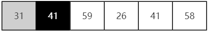
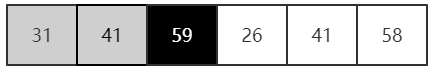
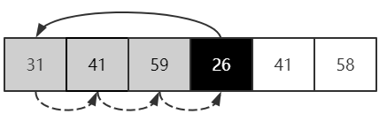
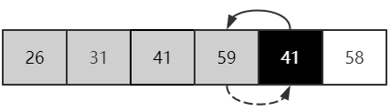
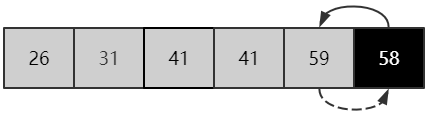
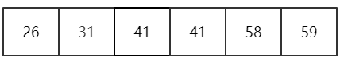
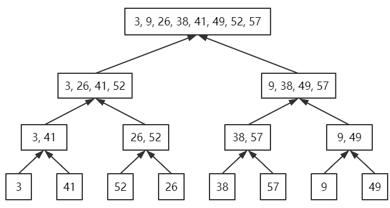
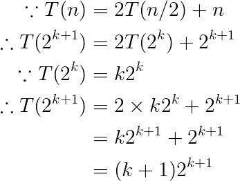
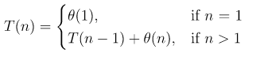
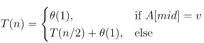

### 2.1-1

(1) 

(2) 

(3) 

(4) 

(5) 

(6) 

### 2.1-2

INSERTION-SORT-DESC(A)

```
for j = 2 to A.length
	key = A[j]
	i = j - 1
	while i > 0 and A[i] <= key
		A[i + 1] = A[i]
		i--
	A[i + 1] = key
```

### 2.1-3

LINEAR-SEARCH(A, v)

```
for j = 1 to A.length
	if A[j] = v
		return j
return NIL
```

循环不变式：在第1行到第3行的循环开始前，子数组A[1..j - 1]中不含有值为v的元素

- 初始化：j = 1时，子数组为空，循环不变式成立
- 保持：在任一循环开始前，循环未停止说明子数组A[1..j - 1]中不含有值为v的元素，否则循环已经停止，循环不变式成立
- 终止：当循环终止，有两种情况：
    - A[k] = v，此时A[1.. k - 1]中不含有值为v的元素，循环不变式成立
    - j = A.length，即未找到指定值，此时子数组即为A，不含有值为v的元素，循环不变式成立

### 2.1-4

BINARY-ADDER(A, B, n)

```
c = 0
C = [n + 1]
for j = n to 1
	s = A[j] + B[j] + c
	C[j] = s % 2
	if s > 1
		c = 1
C[1] = c
```

### 2.2-1


### 2.2-2

SELECTION-SORT(A)

```
for j = 1 to A.length - 1
	// MIN(A, i, j): find the min element in A between index i, j
	// SWAP(a, b): swap element in A
	SWAP(A[j], MIN(A, j, A.length))
```

循环不变式：在第1行到第4行的循环开始前，子数组A[1..j - 1]中元素为A中前j小的元素，且已排序

- 初始化：j = 1时，子数组为空，循环不变式成立
- 保持：在任一循环开始前，通过min(A, j, A.length)找到A中第j小的元素，将其与A的第j个元素进行交换，因此，A中第1小的元素在位置1，第2小的元素在位置2，以此类推，则A[1..j - 1]中元素为A中前j小的元素，且已经排序，循环不变式成立
- 终止：当j = A.length - 1时，A[1..j]元素均已排序，且A[j]元素为A中最大的元素，且已经在位置n上，则整个数组已经排序，循环不变式成立，这也解释了为什么循环只需要到n-1而不是n。

显然，swap函数的运行时间固定为；因此算法的最好运行时间和最坏运行时间均为。

- 因为无论数组是否已经排序，MIN操作和SWAP操作都要进行。

### 2.2-3

显然线性查找最好情况是A[1] = v，最坏情况是A[n] = v;

- 平均需要检查元素个数为，平均运行时间
- 最坏情况$n$，最坏情况运行时间
- 最好情况$1$，最好情况运行时间

### 2.2-4

修改算法，以便测试输入是否满足某些特殊情况，如果是则输出预先计算的答案。最优运行时间一般不能作为算法的性能衡量指标。

### 2.3-1



### 2.3-2

MERGE(A, p, q, r)

```
n1 = q - p + 1
n2 = r - q
let L[1..n1] and R[1..n2] be new arrays
for i = 1 to n1
	L[i] = A[p + i - 1]
for j = 1 to n2
	R[j] = A[q + j]
i = 1
j = 1
k = q
while i < n1 and j < n2
	if L[i] < R[j]
		A[k++] = L[i++]
	else
		A[k++] = R[j++]
while i < n1
	A[k++] = L[i++]
while j < n2
	A[k++] = R[j++]
```

### 2.3-3

证明：

- 当，
- 当，
- 只需证，当时，有

证明：



证毕

### 2.3-4



### 2.3-5

BINARY-SEARCH-ITERATION(A, v)

```
i = 1
j = A.length
while i < j
	k = (i + j) / 2
	if A[k] < v
		i = k + 1
	else if A[k] > v
		j = k - 1
	else 
		return k
if A[i] == v
	return i
else
	return NIL
```

BINARY-SEARCH-RECURSION(A, v, i, j)

```
if i == j and A[i] == v
	return i
else if i == j and A[i] != v
	return NIL
int k = (i + j) / 2
if A[k] < v
	return BINARY-SEARCH-RECURSION(A, v, k + 1, j)
else if A[k] > v
	return BINARY-SEARCH-RECURSION(A, v, i, k - 1)
else
	return k
```

根据伪代码，可写出递归式：



显然可知，当最大迭代次数为时，，即算法结束，因此算法的最坏运行时间为。

### 2.3-6

INSERTION-BINARY-SORT(A)

```
for j = 2 to A.length
	key = A[j]
	// BINARY-SEARCH: find the right position for element A[j]
	pos = BINARY-SEARCH(A, key, 1, j)
	for i = pos to j
		A[i + 1] = A[i]
	A[pos] = key
```

### 2.3-7

分析：

1. 先对S进行归并排序，对序列S中的每个元素$e$，在S中利用二分查找法查找x-e是否存在

FIND-SUM(A, x)

```
MERGE-SORT(A)
for i = 1 to A.length
	// BINARY-SEARCH(A, v, i, j): search x in A between index i and j 
	f = BINARY-SEARCH(A, x - A[i], i + 1, A.length)
	if f != NIL
		return {i, f}
return NIL
```

2. 将序列S分为两部分和，则两数a和b的和刚好为x就有三种情况：

- a和b都在部分

- a和b都在部分

- a在部分，b在部分

